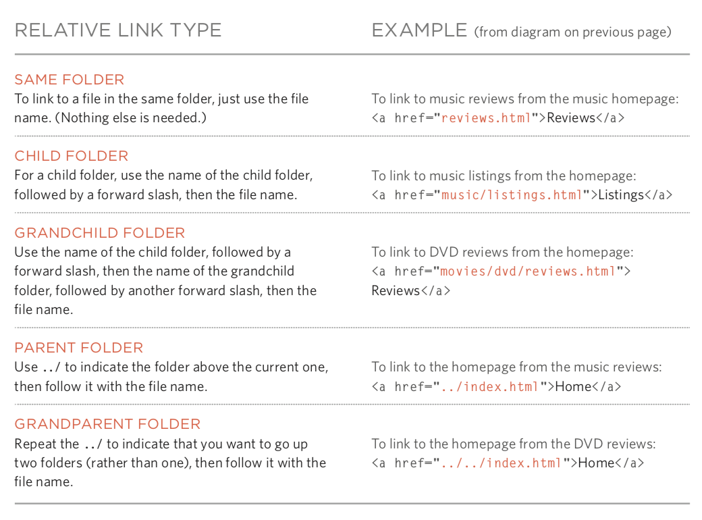
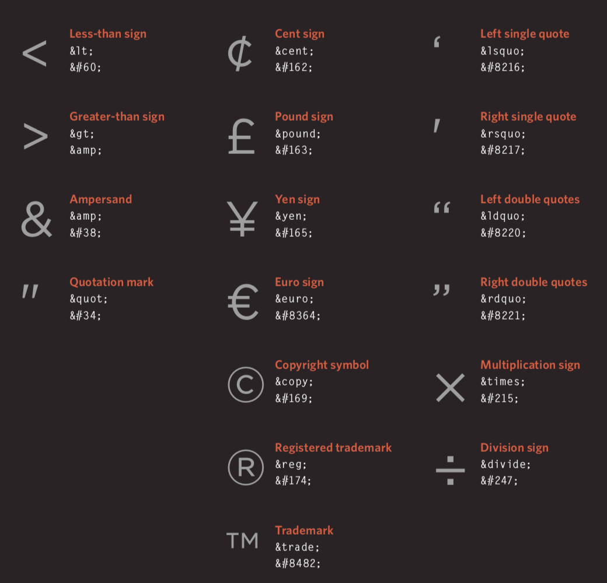
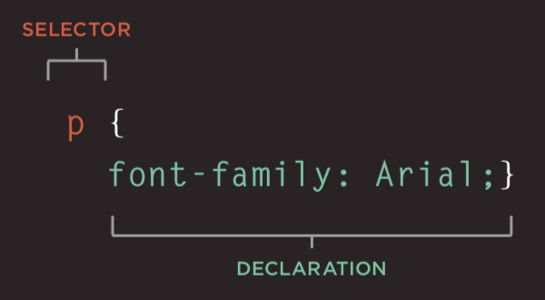
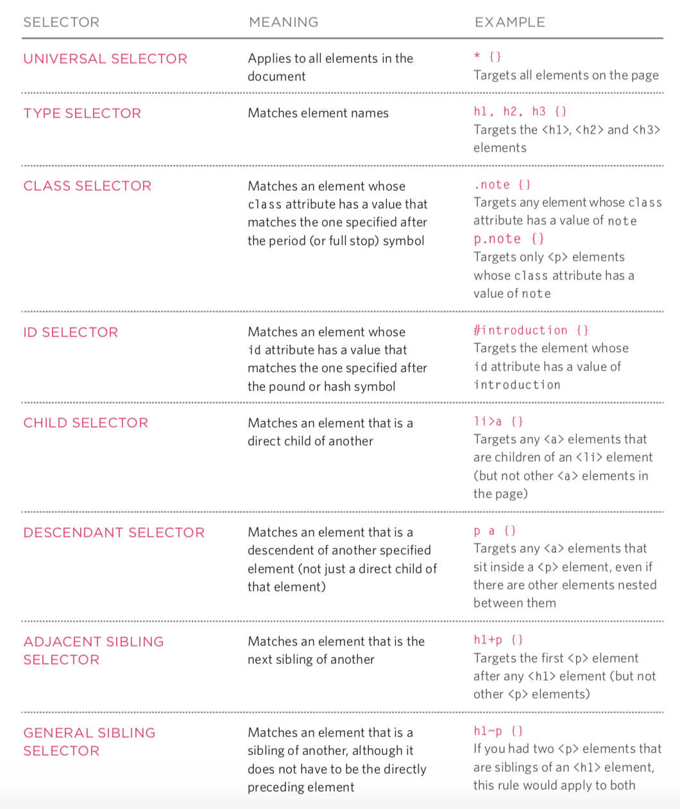
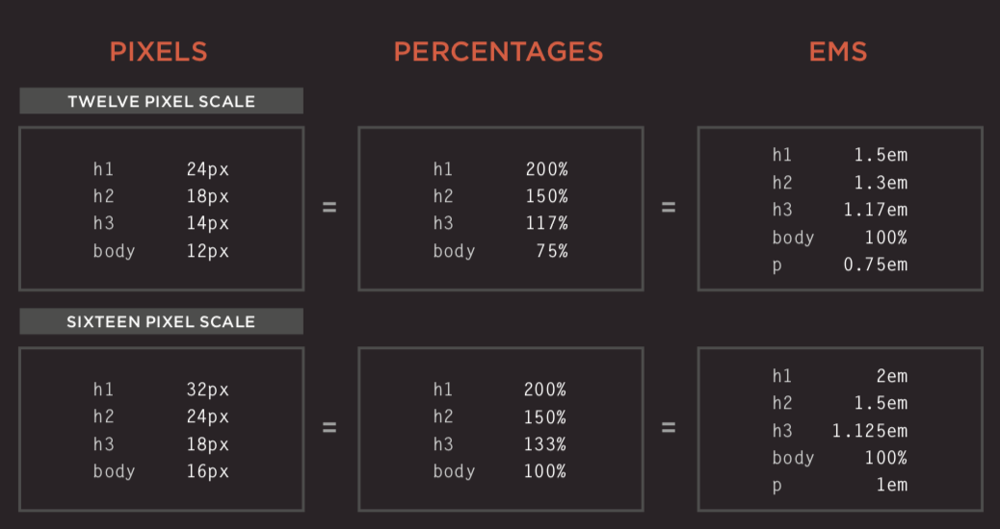
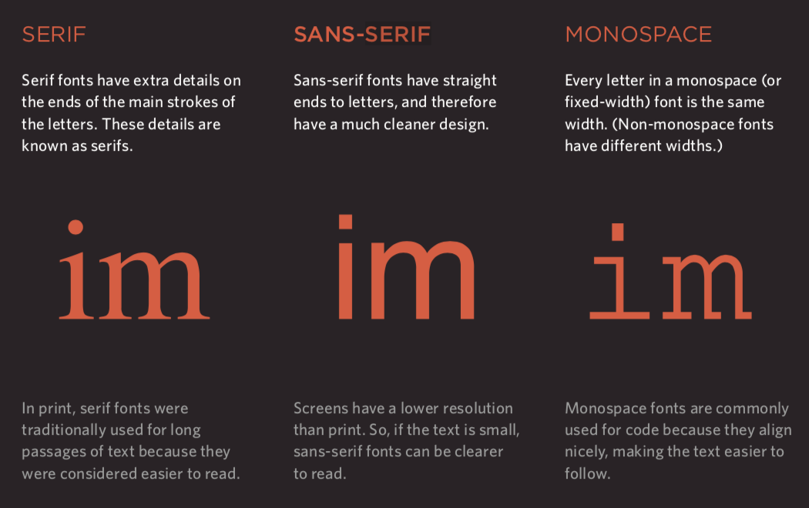
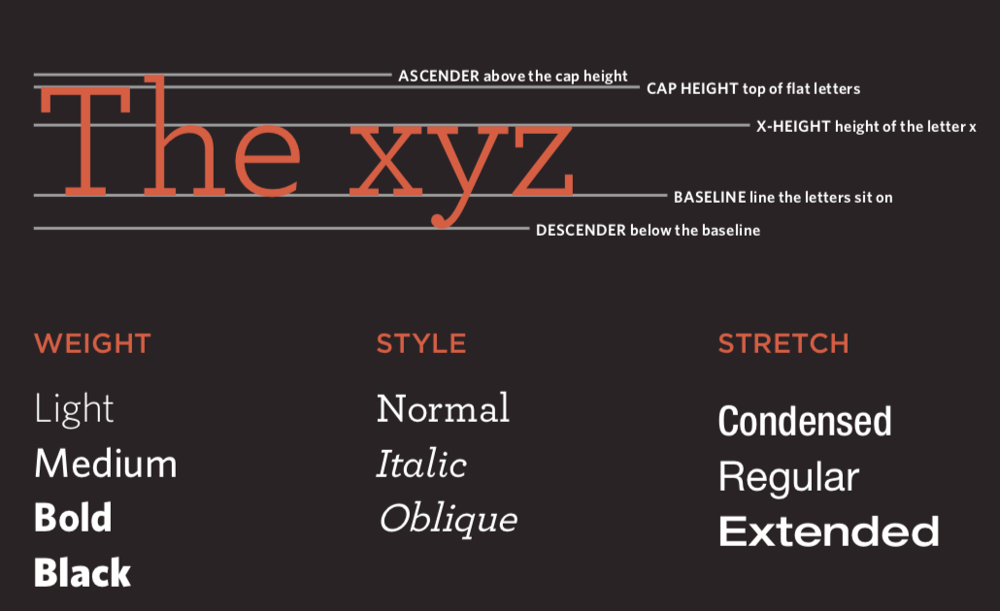
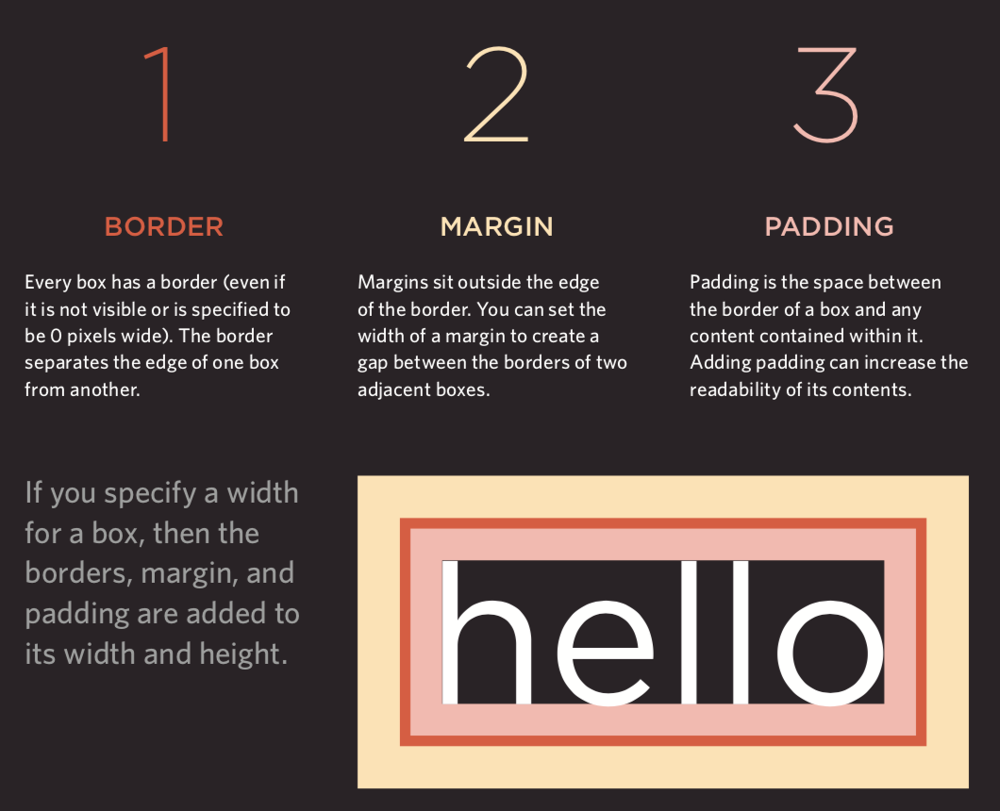
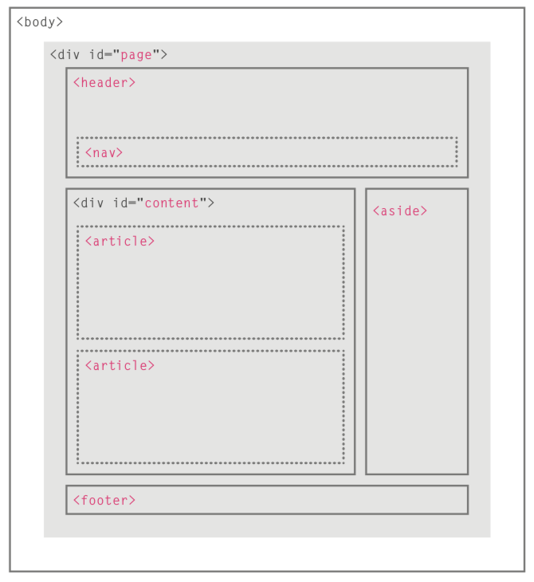

## Web Frontend Overview

> **Note**: Some illustrations used in this lesson come from Jon Duckett's *[HTML and CSS: Design and Build Websites](https://www.amazon.cn/dp/1118008189/ref=sr_1_5?__mk_zh_CN=%E4%BA%9A%E9%A9%AC%E9%80%8A%E7%BD%91%E7%AB%99&keywords=html+%26+css&qid=1554609325&s=gateway&sr=8-5)*. This is a very good book for getting started with frontend development. Interested readers can find a purchase link for this book on Amazon or other websites.

HTML is a language used to describe web pages. Its full name is Hyper-Text Markup Language. The text, buttons, images, videos, and other elements we see when we browse a web page are all written in HTML and shown by the browser.

### HTML Brief History

1. October 1991: an informal CERN document first made 18 HTML tags public. The author of this document was physicist Tim Berners-Lee, so he is the inventor of the World Wide Web and also the chairman of the W3C.
2. November 1995: HTML 2.0 was released as RFC 1866.
3. January 1997: HTML 3.2 was released as a W3C recommendation.
4. December 1997: HTML 4.0 was released as a W3C recommendation.
5. December 1999: HTML 4.01 was released as a W3C recommendation.
6. January 2008: HTML5 was published by the W3C as a working draft.
7. May 2011: the W3C advanced HTML5 to the Last Call stage.
8. December 2012: the W3C designated HTML5 as a Candidate Recommendation.
9. October 2014: HTML5 was released as a stable W3C recommendation. This means the standardization of HTML5 was completed.

#### New Features of HTML5

1. Introduced native multimedia support (`audio` and `video` tags)
2. Introduced programmable content (`canvas` tag)
3. Introduced semantic web support (`article`, `aside`, `details`, `figure`, `footer`, `header`, `nav`, `section`, `summary`, and other tags)
4. Introduced new form controls (calendar, email, search, slider, and so on)
5. Introduced better support for offline storage (`localStorage` and `sessionStorage`)
6. Introduced support for location, drag and drop, WebSocket, background tasks, and so on

### Using Tags to Carry Content


#### Structure

- `html`
  - `head`
    - `title`
    - `meta`
  - `body`

#### Text

- Headings and paragraphs
  - `h1` to `h6`
  - `p`
- Superscript and subscript
  - `sup`
  - `sub`
- Whitespace (white-space collapsing)
- Line breaks and horizontal rules
  - `br`
  - `hr`
- Semantic tags
  - bold and emphasis: `strong`
  - quotations: `blockquote`
  - abbreviations and acronyms: `abbr` / `acronym`
  - citations: `cite`
  - owner contact information: `address`
  - changed content: `ins` / `del`

#### Lists

- Ordered lists: `ol` / `li`
- Unordered lists: `ul` / `li`
- Definition lists: `dl` / `dt` / `dd`

#### Links

- Page links
- Anchor links
- Function links

#### Images

- Image storage location

  
- Images and their width and height
- Choosing the correct image format
  - JPEG
  - GIF
  - PNG
- Vector graphics
- Semantic tags: `figure` / `figcaption`

#### Tables

- Basic table structure: `table` / `tr` / `td` / `th`
- Table title: `caption`
- Row spanning and column spanning: `rowspan` / `colspan`
- Long tables: `thead` / `tbody` / `tfoot`

#### Forms

- Important attributes: `action` / `method` / `enctype`
- Form controls (`input`) - `type` attribute
  - text box: `text` / password box: `password` / number box: `number`
  - email: `email` / phone: `tel` / date: `date` / slider: `range` / URL: `url` / search: `search`
  - radio buttons: `radio` / checkboxes: `checkbox`
  - file upload: `file` / hidden field: `hidden`
  - submit button: `submit` / image button: `image` / reset button: `reset`
- Drop-down lists: `select` / `option`
- Text area (multi-line text): `textarea`
- Grouping form elements: `fieldset` / `legend`

#### Audio and Video

- Video formats and players
- Video hosting services
- Preparation work for adding video
- `video` tags and attributes: `autoplay` / `controls` / `loop` / `muted` / `preload` / `src`
- `audio` tags and attributes: `autoplay` / `controls` / `loop` / `muted` / `preload` / `src` / `width` / `height` / `poster`

#### Frames

- Framesets (outdated, not recommended): `frameset` / `frame`
- Inline frames: `iframe`

#### Other

- Document types

  ```html
  <!doctype html>
  ```

  ```html
  <!DOCTYPE HTML PUBLIC "-//W3C//DTD HTML 4.01//EN" "http://www.w3.org/TR/html4/strict.dtd">
  ```

  ```html
  <!DOCTYPE HTML PUBLIC "-//W3C//DTD HTML 4.01 Transitional//EN" "http://www.w3.org/TR/html4/loose.dtd">
  ```

- Comments

  ```html
  <!-- This is a comment, comments cannot be nested -->
  ```

- Attributes
  - `id`: unique identifier
  - `class`: the class the element belongs to, used to tell different elements apart
  - `title`: extra information of the element (a tooltip is shown when the mouse moves over it)
  - `tabindex`: Tab key switching order
  - `contenteditable`: whether the element can be edited
  - `draggable`: whether the element can be dragged

- Block-level elements / inline elements

- Character entities (entity replacement symbols)

  

### Using CSS to Render Pages

#### Introduction

- What CSS does
- How CSS works
- Rules, properties, and values

  
- Common selectors

  

#### Color

- How to set colors
- Color terms and color contrast
- Background color

#### Text (`text / font`)

- Text size and font family (`font-size / font-family`)

  

  
- Thickness, style, stretch, and decoration (`font-weight / font-style / font-stretch / text-decoration`)

  
- Line height (`line-height`), letter spacing (`letter-spacing`), and word spacing (`word-spacing`)
- Alignment (`text-align`) and indentation (`text-indent`)
- Link styles (`:link / :visited / :active / :hover`)
- New CSS3 properties
  - shadow effect: `text-shadow`
  - first letter and first line text: `:first-letter` / `:first-line`
  - respond to users

#### Box (`box model`)

- Control of box size (`width / height`)

  
- Borders, outer margins, and inner padding (`border / margin / padding`)

  
- Showing and hiding boxes (`display / visibility`)
- New CSS3 properties
  - border images: `border-image`
  - shadow: `border-shadow`
  - rounded corners: `border-radius`

#### Lists, Tables, and Forms

- List bullets: `list-style`
- Table borders and backgrounds: `border-collapse`
- The appearance of form controls
- Alignment of form controls
- Browser developer tools

#### Images

- Controlling image size with `display: inline-block`
- Aligning images
- Background images: `background` / `background-image` / `background-repeat` / `background-position`

#### Layout

- Control element position (`position / z-index`)
  - normal flow
  - relative positioning
  - absolute positioning
  - fixed positioning
  - floating elements: `float` / `clear`
- Website layout
  - HTML5 layout

    
- Adapt to screen size
  - fixed-width layouts
  - fluid layouts
  - layout grids

### Using JavaScript to Control Behavior

#### Basic JavaScript Syntax

- Statements and comments
- Variables and data types
  - declaration and assignment
  - simple data types and complex data types
  - variable naming rules
- Expressions and operators
  - assignment operators
  - arithmetic operators
  - comparison operators
  - logical operators: `&&`, `||`, `!`
- Branching
  - `if...else...`
  - `switch...case...default...`
- Loop structures
  - `for` loop
  - `while` loop
  - `do...while` loop
- Arrays
  - creating arrays
  - operating on elements in arrays
- Functions
  - declaring functions
  - calling functions
  - arguments and return values
  - anonymous functions
  - immediately invoked functions

#### Object-Oriented

- The concept of objects
- Literal syntax for creating objects
- Member access operator
- Constructor syntax for creating objects
  - the `this` keyword
- Adding and deleting properties
  - the `delete` keyword
- Standard objects
  - `Number` / `String` / `Boolean` / `Symbol` / `Array` / `Function`
  - `Date` / `Error` / `Math` / `RegExp` / `Object` / `Map` / `Set`
  - `JSON` / `Promise` / `Generator` / `Reflect` / `Proxy`

#### BOM

- Properties and methods of the `window` object
- The `history` object
  - `forward()` / `back()` / `go()`
- The `location` object
- The `navigator` object
- The `screen` object

#### DOM

- DOM tree
- Accessing elements
  - `getElementById()` / `querySelector()`
  - `getElementsByClassName()` / `getElementsByTagName()` / `querySelectorAll()`
  - `parentNode` / `previousSibling` / `nextSibling` / `children` / `firstChild` / `lastChild`
- Operating on elements
  - `nodeValue`
  - `innerHTML` / `textContent` / `createElement()` / `createTextNode()` / `appendChild()` / `insertBefore()` / `removeChild()`
  - `className` / `id` / `hasAttribute()` / `getAttribute()` / `setAttribute()` / `removeAttribute()`
- Event handling
  - event types
    - UI events: `load` / `unload` / `error` / `resize` / `scroll`
    - keyboard events: `keydown` / `keyup` / `keypress`
    - mouse events: `click` / `dbclick` / `mousedown` / `mouseup` / `mousemove` / `mouseover` / `mouseout`
    - focus events: `focus` / `blur`
    - form events: `input` / `change` / `submit` / `reset` / `cut` / `copy` / `paste` / `select`
  - event binding
    - HTML event handlers (not recommended, because we should separate tags and code)
    - traditional DOM event handlers (can only add one callback function)
    - event listeners (not supported in old browsers)
  - event flow: event capture / event bubbling
  - event objects (in low-version IE, `window.event`)
    - `target` (some browsers use `srcElement`)
    - `type`
    - `cancelable`
    - `preventDefault()`
    - `stopPropagation()` (`cancelBubble` in low-version IE)
  - mouse events - where the event happened
    - screen position: `screenX` and `screenY`
    - page position: `pageX` and `pageY`
    - client position: `clientX` and `clientY`
  - keyboard events - which key was pressed
    - `keyCode` property (some browsers use `which`)
    - `String.fromCharCode(event.keyCode)`
  - HTML5 events
    - `DOMContentLoaded`
    - `hashchange`
    - `beforeunload`

#### JavaScript API

- Client storage: `localStorage` and `sessionStorage`

  ```javascript
  localStorage.colorSetting = '#a4509b';
  localStorage['colorSetting'] = '#a4509b';
  localStorage.setItem('colorSetting', '#a4509b');
  ```

- Get location information: `geolocation`

  ```javascript
  navigator.geolocation.getCurrentPosition(function(pos) {
      console.log(pos.coords.latitude)
      console.log(pos.coords.longitude)
  })
  ```

- Getting data from the server: Fetch API
- Drawing graphics: the API of `<canvas>`
- Audio and video: the APIs of `<audio>` and `<video>`

### Frontend Frameworks

#### Progressive Framework - [Vue.js](https://cn.vuejs.org/)

This is a must-have framework for frontend-backend separated development (frontend rendering).

##### Quick Start

1. Import Vue's JavaScript file. We still recommend loading it from a CDN server.

   ```html
   <script src="https://cdn.jsdelivr.net/npm/vue"></script>
   ```

2. Data binding (declarative rendering).

   ```html
   <div id="app">
       <h1>{{ product }} inventory information</h1>
   </div>

   <script src="https://cdn.jsdelivr.net/npm/vue"></script>
   <script>
       const app = new Vue({
           el: '#app',
           data: {
               product: 'iPhone X'
           }
       });
   </script>
   ```

3. Conditions and loops.

   ```html
   <div id="app">
       <h1>Inventory information</h1>
       <hr>
       <ul>
           <li v-for="product in products">
               {{ product.name }} - {{ product.quantity }}
               <span v-if="product.quantity === 0">
                   Sold out
               </span>
           </li>
       </ul>
   </div>
   
   <script src="https://cdn.jsdelivr.net/npm/vue"></script>
   <script>
       const app = new Vue({
           el: '#app',
           data: {
               products: [
                   {"id": 1, "name": "iPhone X", "quantity": 20},
                   {"id": 2, "name": "Huawei Mate20", "quantity": 0},
                   {"id": 3, "name": "Xiaomi Mix3", "quantity": 50}
               ]
           }
       });
   </script>
   ```

4. Computed properties.

   ```html
   <div id="app">
       <h1>Inventory information</h1>
       <hr>
       <ul>
           <li v-for="product in products">
               {{ product.name }} - {{ product.quantity }}
               <span v-if="product.quantity === 0">
                   Sold out
               </span>
           </li>
       </ul>
       <h2>Total inventory: {{ totalQuantity }} units</h2>
   </div>

   <script src="https://cdn.jsdelivr.net/npm/vue"></script>
   <script>
       const app = new Vue({
           el: '#app',
           data: {
               products: [
                   {"id": 1, "name": "iPhone X", "quantity": 20},
                   {"id": 2, "name": "Huawei Mate20", "quantity": 0},
                   {"id": 3, "name": "Xiaomi Mix3", "quantity": 50}
               ]
           },
           computed: {
               totalQuantity() {
                   return this.products.reduce((sum, product) => {
                       return sum + product.quantity
                   }, 0);
               }
           }
       });
   </script>
   ```

5. Handling events.

   ```html
   <div id="app">
       <h1>Inventory information</h1>
       <hr>
       <ul>
           <li v-for="product in products">
               {{ product.name }} - {{ product.quantity }}
               <span v-if="product.quantity === 0">
                   Sold out
               </span>
               <button @click="product.quantity += 1">
                   Increase inventory
               </button>
           </li>
       </ul>
       <h2>Total inventory: {{ totalQuantity }} units</h2>
   </div>

   <script src="https://cdn.jsdelivr.net/npm/vue"></script>
   <script>
       const app = new Vue({
           el: '#app',
           data: {
               products: [
                   {"id": 1, "name": "iPhone X", "quantity": 20},
                   {"id": 2, "name": "Huawei Mate20", "quantity": 0},
                   {"id": 3, "name": "Xiaomi Mix3", "quantity": 50}
               ]
           },
           computed: {
               totalQuantity() {
                   return this.products.reduce((sum, product) => {
                       return sum + product.quantity
                   }, 0);
               }
           }
       });
   </script>
   ```

6. User input.

   ```html
   <div id="app">
       <h1>Inventory information</h1>
       <hr>
       <ul>
           <li v-for="product in products">
               {{ product.name }} -
               <input type="number" v-model.number="product.quantity" min="0">
               <span v-if="product.quantity === 0">
                   Sold out
               </span>
               <button @click="product.quantity += 1">
                   Increase inventory
               </button>
           </li>
       </ul>
       <h2>Total inventory: {{ totalQuantity }} units</h2>
   </div>

   <script src="https://cdn.jsdelivr.net/npm/vue"></script>
   <script>
       const app = new Vue({
           el: '#app',
           data: {
               products: [
                   {"id": 1, "name": "iPhone X", "quantity": 20},
                   {"id": 2, "name": "Huawei Mate20", "quantity": 0},
                   {"id": 3, "name": "Xiaomi Mix3", "quantity": 50}
               ]
           },
           computed: {
               totalQuantity() {
                   return this.products.reduce((sum, product) => {
                       return sum + product.quantity
                   }, 0);
               }
           }
       });
   </script>
   ```

7. Load JSON data through the network.

   ```html
   <div id="app">
       <h2>Inventory information</h2>
       <ul>
           <li v-for="product in products">
               {{ product.name }} - {{ product.quantity }}
               <span v-if="product.quantity === 0">
                   Sold out
               </span>
           </li>
       </ul>
   </div>

   <script src="https://cdn.jsdelivr.net/npm/vue"></script>
   <script>
       const app = new Vue({
           el: '#app',
           data: {
               products: []
           },
           created() {
               fetch('https://jackfrued.top/api/products')
                   .then(response => response.json())
                   .then(json => {
                       this.products = json
                   });
           }
       });
   </script>
   ```

##### Using the Scaffolding Tool - `vue-cli`

Vue provides the very convenient scaffolding tool `vue-cli` for commercial project development. Through this tool, we can skip manually configuring the development environment, test environment, and running environment, so developers only need to care about the problem they want to solve.

1. Install the scaffolding tool.
2. Create the project.
3. Install dependency packages.
4. Run the project.

#### UI Framework - [Element](http://element-cn.eleme.io/#/zh-CN)

A desktop component library based on Vue 2.0. It is used to build user interfaces and supports responsive layout.

1. Import Element's CSS and JavaScript files.

   ```html
   <!-- Import style -->
   <link rel="stylesheet" href="https://unpkg.com/element-ui/lib/theme-chalk/index.css">
   <!-- Import component library -->
   <script src="https://unpkg.com/element-ui/lib/index.js"></script>
   ```

2. A simple example.

   ```html
   <!DOCTYPE html>
   <html>
       <head>
           <meta charset="UTF-8">
           <link rel="stylesheet" href="https://unpkg.com/element-ui/lib/theme-chalk/index.css">
       </head>
       <body>
           <div id="app">
               <el-button @click="visible = true">Click me</el-button>
               <el-dialog :visible.sync="visible" title="Hello world">
                   <p>Start using Element</p>
               </el-dialog>
           </div>
       </body>
       <script src="https://unpkg.com/vue/dist/vue.js"></script>
       <script src="https://unpkg.com/element-ui/lib/index.js"></script>
       <script>
           new Vue({
               el: '#app',
               data: {
                   visible: false,
               }
           })
       </script>
   </html>
   ```

3. Use components.

   ```html
   <!DOCTYPE html>
   <html>
       <head>
           <meta charset="UTF-8">
           <link rel="stylesheet" href="https://unpkg.com/element-ui/lib/theme-chalk/index.css">
       </head>
       <body>
           <div id="app">
               <el-table :data="tableData" stripe style="width: 100%">
                   <el-table-column prop="date" label="Date" width="180">
                   </el-table-column>
                   <el-table-column prop="name" label="Name" width="180">
                   </el-table-column>
                   <el-table-column prop="address" label="Address">
                   </el-table-column>
               </el-table>
           </div>
       </body>
       <script src="https://unpkg.com/vue/dist/vue.js"></script>
       <script src="https://unpkg.com/element-ui/lib/index.js"></script>
       <script>
           new Vue({
               el: '#app',
               data: {
                   tableData:  [
                       {
                           date: '2016-05-02',
                           name: 'Wang Yiba',
                           address: 'No. 1518, Jinshajiang Road, Putuo District, Shanghai'
                       },
                       {
                           date: '2016-05-04',
                           name: 'Liu Ergou',
                           address: 'No. 1517, Jinshajiang Road, Putuo District, Shanghai'
                       },
                       {
                           date: '2016-05-01',
                           name: 'Yang Sanmeng',
                           address: 'No. 1519, Jinshajiang Road, Putuo District, Shanghai'
                       },
                       {
                           date: '2016-05-03',
                           name: 'Chen Sichui',
                           address: 'No. 1516, Jinshajiang Road, Putuo District, Shanghai'
                       }
                   ]
               }
           })
       </script>
   </html>
   ```

#### Chart Framework - [ECharts](https://echarts.baidu.com)

An open-source visualization library made by Baidu. It is often used to generate many kinds of charts.


#### CSS Framework Based on Flexbox - [Bulma](https://bulma.io/)

Bulma is a modern CSS framework based on Flexbox. Its original idea is mobile first and modular design. It can be used easily to build many simple or complex content layouts. Even developers who do not understand CSS can use it to make beautiful pages.

```html
<!DOCTYPE html>
<html lang="en">
<head>
    <meta charset="UTF-8">
    <title>Bulma</title>
    <link href="https://cdn.bootcss.com/bulma/0.7.4/css/bulma.min.css" rel="stylesheet">
    <style type="text/css">
        div { margin-top: 10px; }
        .column { color: #fff; background-color: #063; margin: 10px 10px; text-align: center; }
    </style>
</head>
<body>
    <div class="columns">
        <div class="column">1</div>
        <div class="column">2</div>
        <div class="column">3</div>
        <div class="column">4</div>
    </div>
    <div>
        <a class="button is-primary">Primary</a>
        <a class="button is-link">Link</a>
        <a class="button is-info">Info</a>
        <a class="button is-success">Success</a>
        <a class="button is-warning">Warning</a>
        <a class="button is-danger">Danger</a>
    </div>
    <div>
        <progress class="progress is-danger is-medium" max="100">60%</progress>
    </div>
    <div>
        <table class="table is-hoverable">
            <tr>
                <th>One</th>
                <th>Two</th>
            </tr>
            <tr>
                <td>Three</td>
                <td>Four</td>
            </tr>
            <tr>
                <td>Five</td>
                <td>Six</td>
            </tr>
            <tr>
                <td>Seven</td>
                <td>Eight</td>
            </tr>
            <tr>
                <td>Nine</td>
                <td>Ten</td>
            </tr>
            <tr>
                <td>Eleven</td>
                <td>Twelve</td>
            </tr>
        </table>
    </div>
</body>
</html>
```

#### Responsive Layout Framework - [Bootstrap](http://www.bootcss.com/)

A frontend framework used to quickly develop Web applications. It supports responsive layout.

1. Features
   - Supports mainstream browsers and mobile devices
   - Easy to get started
   - Responsive design

2. Content
   - Grid system
   - Wrapped CSS
   - Ready-made components
   - JavaScript plugins

3. Visualization

   
